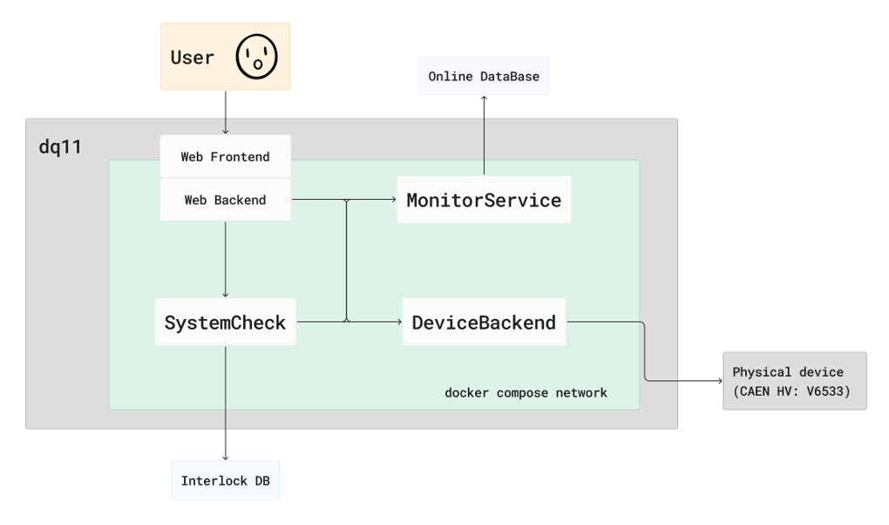

# CAEN Microservices

A set of microservices implementating the CAEN management architecture 

## Basic layout

The scheme of microservices interaction looks like (the arrows display requests directions):


## List of microservices

### [WebService](./caen_tools/WebService/)
Provides a web interface to the user and defines REST API.
Contains web frontend and web backend.

* Main endponits:
  * `/`: frontend webpage for CAEN management
  * `/docs` (`/redoc`): contains a complete list of available API endpoints

### [DeviceBackend](./caen_tools/DeviceBackend/)
Executes commands from other microservices on the CAEN device itself

* Recieves **Receipts** and executes them:
  * *Set_Voltage*: sets a specified voltage on the CAEN device
  * *Down*: completely turns off voltage on the CAEN device
  * *Get_Params*: receives the current CAEN device parameters (voltage, current, statuses and so on)
* Uses [`caen_setup`](https://github.com/caenHV/Setup/) python package for the CAEN device interaction

### [MonitorService](./caen_tools/MonitorService/)
Stores device parameters in the database and sends to Online DataBase&nbsp;(ODB)

* Recieves **Receipts** and executes them:
  * *Send_Params*: sends parameters into database and ODB
  * *Get_Params*: retrieves historical data from the database

### [SystemCheck](./caen_tools/SystemCheck/)
A service cyclically running scenarios of interaction 
with other microservices (so called *scripts*) 
that inspect the device parameters,
send the availability status to MChS, 
transfer parameters from DeviceBackend to MonitorService,
maintain the target voltage and interlock following (if needed)

* Receives **Receipts** and executes them:
  * *Status*: returns the status of the executing scripts
  * *Status_autopilot*: returns the status of a group of scripts that are used for automatic operation of the device
  * *Set_autopilot*: enables / disables autopilot

## Environment setting
As shown in the figure above, the current version of the system is running on a single machine (*dq11*), but all the services are located in their own docker containers and connected using docker compose.

The complete environment setup instructions can be found in the separate [`environment`](https://github.com/caenHV/environment/) repository.

## Development
There are several advices to quickly start the development process of this project.

### Quick start

1) Prerequests:
   * `python>=3.11.2`
   * `npm` (optional, to build frontend webpage)

2) Clone the repository with submodules (it will be *frontend* in this case)
```bash
git clone --recursive https://github.com/caenHV/caen_tools.git
```

3) Prepare and run virtual environment
```bash
cd caen_tools
python -m venv ./venv
source venv/bin/activate
```

4) Install development version of the `caen_tools`
```bash
pip install -e .[webservice]
```
create an empty directory to prevent crash of the webservice (until you build frontend)
```bash
mkdir -p caen_tools/WebService/frontend/build/static
```

5) Now it's possible to run microservices that you need by the following commands:
  * `caen_webserver` - runs webservice (now without main frontend webpage but already with `http://localhost:8000/docs` containing all available endpoints)
  * `caen_device_backend` - runs DeviceBackend microserice
  * `caen_monitor` - runs MonitorService
  * `caen_system_check` - runs SystemCheck


4) Optional: build frontend
```bash
cd caen_tools/caen_tools/WebService/frontend/
npm install package.json
export REACT_APP_CAEN=production && npm run build
```
if all is ok, you'll see the build folder in current directory and when you start the web server, you will see the main frontend page `http://localhost:8000`

### Build package
if you want to build your own `whl` locally, you can do that.

* Build the package from the directory containing `pyproject.toml`
```bash
python3 -m pip install --upgrade build
python3 -m build
```

### Github actions
If you work with github repository, it supports automatic build on push of the tag.

Suppose, that you already pushed all your commits into the remote github repository and want to get build `whl` file, so: 
```bash
git fetch origin --tags # fetch tags from remote origin repo 
git tag v2.2.7-experimental # create your own tag of the current commit 
git push origin --tags
```
* Now in [actions](https://github.com/caenHV/caen_tools/actions) you will see the build. 
* Choose your commit, select on it and download artifact `caen_tools.zip`
* Unpack it locally, it contains builded `whl`


# Running
to quickly try this module you need download `.whl` file from [latest](https://github.com/caenHV/caen_tools/releases/latest) release and then

```bash
python -m venv ./venv # create virtual environment
source venv/bin/activate # activate it
pip install "<filename>.whl[webservice]" # install this package
```

Run all of the microservices
```bash
caen_device_backend &
caen_monitor &
caen_system_check &
caen_webservice &
```
Go to `http://localhost:8000`

To simply close all of these microservices, run the following command in the other console window (this command will kill all processes whose name starting with *caen_*)
```bash
pkill -f caen_
```

## Helpful links
* [ZMQ Guide](https://zguide.zeromq.org/)
* [ZMQ Socket API](https://zeromq.org/socket-api/)
* [PyZMQ API](https://pyzmq.readthedocs.io/en/latest/api/zmq.html)
* [Install package from git](https://github.com/pypa/pip/issues/6548)
* [Git submodules](https://git-scm.com/book/ru/v2/%D0%98%D0%BD%D1%81%D1%82%D1%80%D1%83%D0%BC%D0%B5%D0%BD%D1%82%D1%8B-Git-%D0%9F%D0%BE%D0%B4%D0%BC%D0%BE%D0%B4%D1%83%D0%BB%D0%B8)
* [PIP extra dependencies](https://setuptools.pypa.io/en/latest/userguide/dependency_management.html)